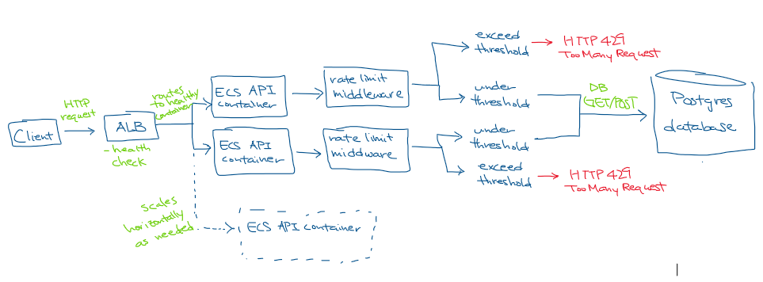

# Cloud Architecture Synthesis & System Evolution

## Project Overview

Modern cloud systems must be designed to scale, tolerate failure, and balance trade-offs between consistency, availability, latency, and cost.

In previous assignments, you built and deployed a cloud service. In this assignment, you will:

Design an improved cloud architecture for your system.
Implement one targeted enhancement to your existing system.
This assignment emphasizes architectural reasoning, trade-offs, and system evolution.

#### Goal: Evolve cloud system to handle:

- higher scale
- real-world failures
- performance bottlenecks

#### Improvement Implemented: Rate limiting

- limit requests per client/IP
- return HTTP 429 Too Many Requests

### Tech Stack

- FastAPI
- PostgreSQL
- Alembic
- Docker and Docker Compose
- AWS ECS Fargate, ALB, RDS, CloudWatch
- k6 load testing

## Project Structure

```bash
containerized-service-cloud-native-api/
├── .venv/
├── alembic/
│   ├── versions/      # Migrations
│   └── env.py         # Configuration for migration
├── app/
│   ├── main.py        # FastAPI app, endpoints
│   ├── database.py    # PostgreSQL connection, queries
│   ├── schemas.py     # Pydantic models
│   └── logger.py      # Structured JSON logging
├── docker-compose.yml
├── Dockerfile
├── entrypoint.sh       # Entrypoint script for docker build
├── loadtest.js         # k6 loadtest
├── k6-results.txt      # k6 loadtest results
├── requirements.txt
└── README.md
```

## Architecture

### Local

```
Client -> API container (+ newly added rate-limit middleware) -> Postgres container
```

### Cloud

```
Client -> ALB -> ECS Fargate API container (+ newly added rate-limit middleware) -> RDS PostgreSQL
```

## Setup

### Prerequisites

- Docker Desktop
- Python 3.12
- k6 CLI
- AWS (not needed unless you want to deploy)

### Git clone

```bash
git clone https://github.com/yukkigu/cloud-architecture-expansion.git
```

### API Endpoints

| Method | Endpoint             | Description             |
| ------ | -------------------- | ----------------------- |
| `POST` | `/orders`            | Create a new order      |
| `GET`  | `/orders/{order_id}` | Retrieve an order by ID |
| `POST` | `/items`             | Insert new item         |
| `GET`  | `/items/{item_id}`   | Retrieve an order by ID |
| `GET`  | `/health`            | Check health status     |

## Architectural Expansion



In the original architecture, all incoming requests must be processed, which makes the system vulnerable to excessive traffic from a single client. The rate-limiting mechanism addresses this issue by tracking requests per client IP and rejecting requests that exceed the set threshold. This expansion is needed because it prevents one client from consuming a large amount of the system resources. By filtering excessive requests, it reduces unnecessary usage of system resources and allows for a fairer distribution of resources across users. The main tradeoff is that the current architecture implements rate limits within each container rather than a shared rate limiter. However, this expansion improves system resilience and performance under high traffic.

### Rate Limiting Implementation

Goal: Prevent a single client from sending too many requests in a short time window and overloading the system resources.

- Uses per-client/IP sliding window algorithm to track recent requests
  - Exceeds threshold = HTTP 429 Too Many Request error
- Uses an in-memory per-container rate limiter

**Current implementation metrics**

- Rate limit: 5 requests
- Time window: 10 seconds
- Per client IP
- /health is not affected

## Local Setup

### 1. Set up environment

#### Local Secret Handling:

Create local `.env` file that is not pushed to git repo (added in .gitignore):

```bash
DB_USER=postgres
DB_PASSWORD=your_password
DB_NAME=orders
DB_HOST_PORT=55400
APP_PORT=8080
```

### 2. Run Local Stack

```bash
docker compose up -d --build
```

## Verification

### Local: Compose Boot + DB-Aware Health Check

```bash
docker compose up -d --build
docker compose ps
curl -i http://localhost:8080/health
```

Expected Behavior:

- HTTP `200 OK`
- JSON response containing:
  - `db: "connected"`
  - `status: "ok"`

### Local: Adding and retrieving item

```bash
curl -s -X POST http://localhost:8080/items \
-H "Content-Type: application/json" \
-d '{"name":"alpha","value":123}'

# retrieve same item
curl -s http://localhost:8080/items/1
```

Expected behavior:

- Record still added and can be retrieved

### Local: Sending multiple requests (rate limiting)

```bash
# send 8 requests
for i in {1..8}; do
  curl -s -i http://localhost:8080/items/1 | head -n 1
done
```

Expected behavior:

- First 5 request returns status `200 OK`
- Last 3 returns `HTTP 429 Too Many Requests`

```bash
# expected response
HTTP/1.1 200 OK
HTTP/1.1 200 OK
HTTP/1.1 200 OK
HTTP/1.1 200 OK
HTTP/1.1 200 OK
HTTP/1.1 429 Too Many Requests
HTTP/1.1 429 Too Many Requests
HTTP/1.1 429 Too Many Requests
```

### Local: Rate limit on invalid items

```bash
# send 8 requests
for i in {1..8}; do
  curl -s -i http://localhost:8080/items/1 | head -n 1
done
```

Expected behavior:

- First 5 request returns status `404 Not Found`
- Last 3 returns `HTTP 429 Too Many Requests`

### Local: Rate limit not limiting for health checks

```bash
# send 8 requests to /health endpoint
for i in {1..8}; do
  curl -s -i http://localhost:8080/health | head -n 1
done
```
